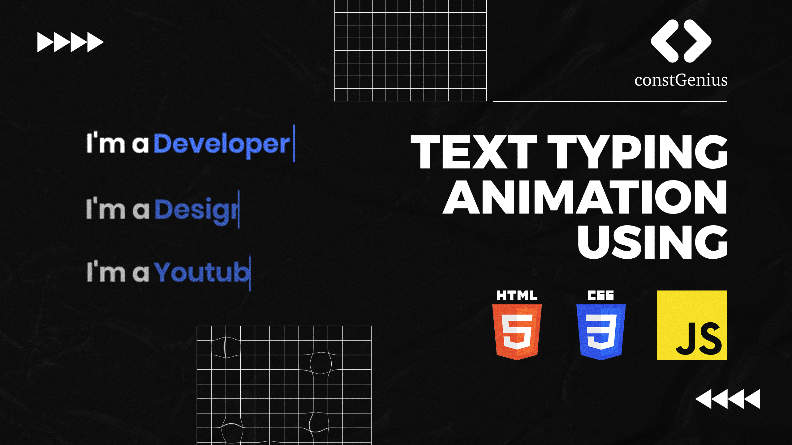

# Text Typing Animation Using HTML CSS JavaScript | Auto Typing Effect on Website

The Text Typing Animation, created with HTML, CSS, and JavaScript, introduces an engaging and dynamic element to a website. This effect simulates the process of text being typed out automatically, character by character, creating an appealing and attention-grabbing user experience. HTML structures the content, CSS styles contribute to the visual presentation, and JavaScript controls the typing animation, providing a seamless and interactive touch to the website. This auto-typing effect is commonly used in headers, banners, or introductory sections to capture visitors' attention and convey information in a dynamic and modern way.

